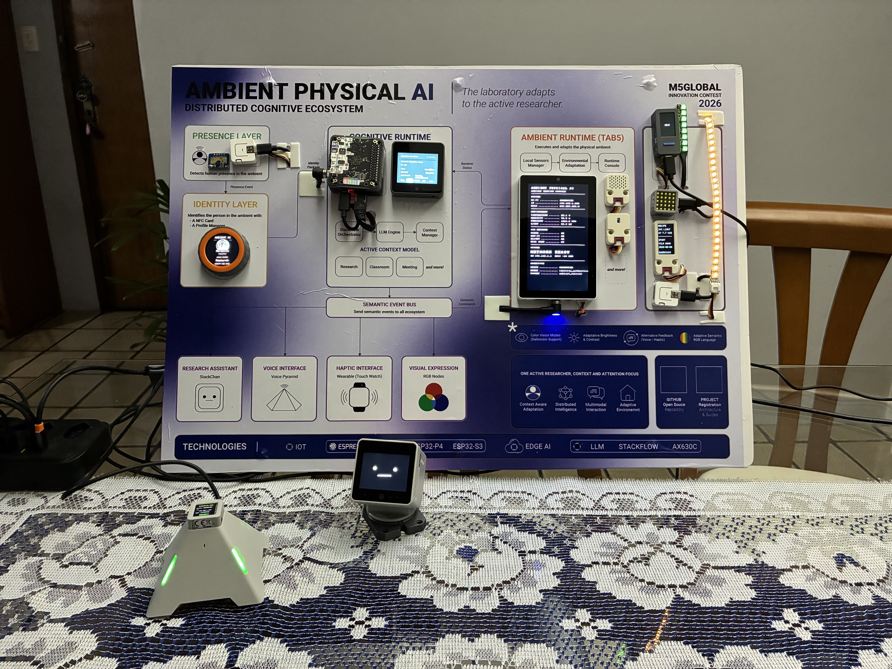
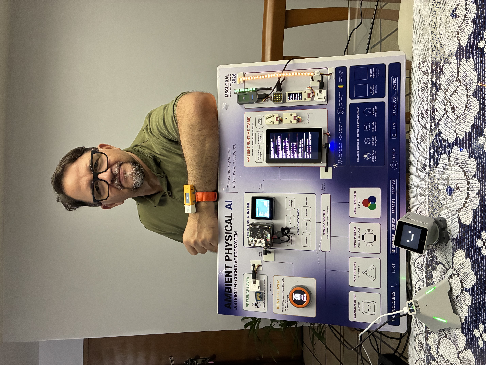
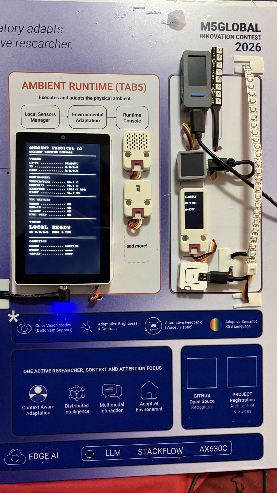
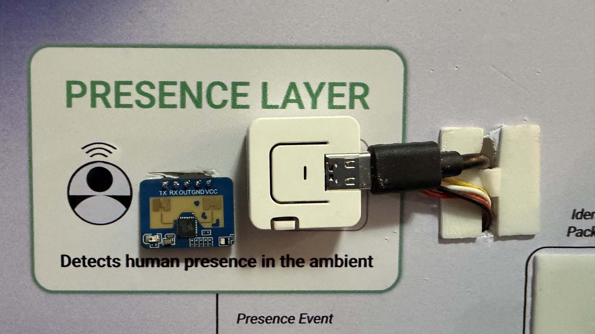
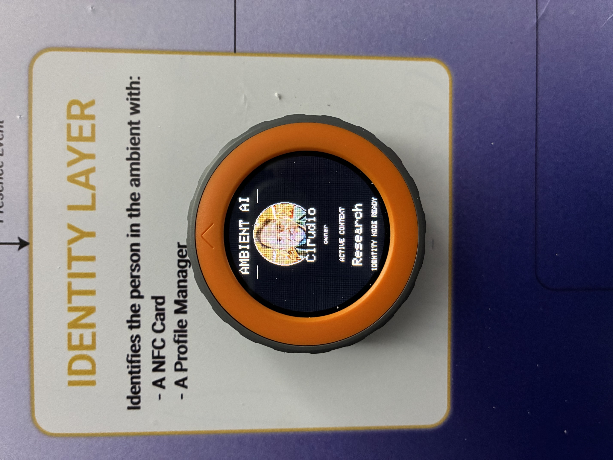
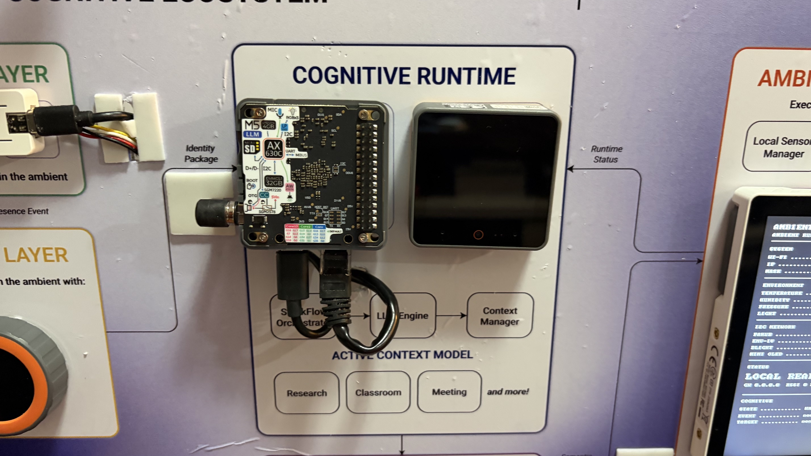
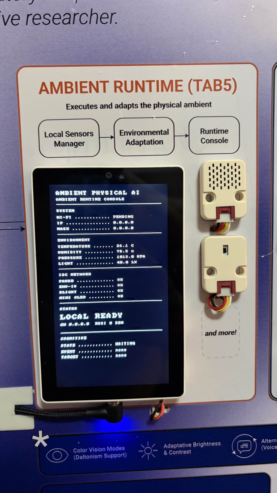

## Distributed Cognitive Ecosystem Powered by StackFlow

> **The environment understands the person.**

> *An open research platform investigating how Context-Aware Computing,
> Embedded Artificial Intelligence and Distributed Cognitive Systems can
> transform physical environments into intelligent partners for human
> interaction.*

------------------------------------------------------------------------

# Ambient Physical AI



------------------------------------------------------------------------

# Why Ambient Physical AI?

Most Artificial Intelligence systems today still live inside screens.

They wait for commands.

They rarely understand where people are, who they are, what is happening
around them, or how the surrounding environment should respond.

Ambient Physical AI investigates a different question:

> **What happens when the environment itself becomes intelligent?**

Instead of building another chatbot or another IoT dashboard, this
project explores how an intelligent environment can perceive,
understand, reason and physically express itself through a distributed
ecosystem of embedded devices coordinated by a centralized cognitive
runtime.

This repository documents that journey.

------------------------------------------------------------------------

# Research Motivation

The origins of Ambient Physical AI can be traced back several years,
during graduate studies in Computer Science.

It was during this period that **Professor Dr. Carlos Ferraz**
introduced the concepts of **Context-Aware Computing**, planting the
seed for a research question that would remain active for many years:

> **Can computers understand not only explicit commands, but also the
> context in which people exist?**

At that time, the vision was compelling, but the necessary technology
was still immature.

Embedded processors had limited computational power.

Edge Artificial Intelligence was still emerging.

Large Language Models did not yet exist.

Affordable multimodal sensors were uncommon.

Today, this landscape has changed dramatically.

Modern embedded processors, Edge AI accelerators, distributed embedded
systems, speech recognition, computer vision and local Large Language
Models finally make it possible to revisit those original ideas through
real hardware.

Ambient Physical AI is the result of that evolution.

------------------------------------------------------------------------

# Scientific Inspiration

One of the strongest conceptual inspirations behind this project is the
work of **Mark Weiser**, widely recognized as the pioneer of Ubiquitous
Computing.

His vision remains remarkably current:

> *"The most profound technologies are those that disappear. They weave
> themselves into the fabric of everyday life until they are
> indistinguishable from it."*

Ambient Physical AI adopts this philosophy as a practical engineering
goal.

Instead of making computers more visible, the project investigates how
computation can become naturally embedded into physical environments,
allowing technology to support people without demanding constant
attention.

------------------------------------------------------------------------

# From Context-Aware Computing to Ambient Physical AI

The evolution of the research can be summarized as:

``` text
Context-Aware Computing
            ↓
Embedded Systems
            ↓
Internet of Things
            ↓
Edge Computing
            ↓
Embedded Artificial Intelligence
            ↓
Large Language Models
            ↓
Distributed Cognitive Systems
            ↓
Ambient Physical AI
```

Rather than replacing previous ideas, Ambient Physical AI integrates
them into a single distributed architecture.

------------------------------------------------------------------------

# Project Vision

Ambient Physical AI is not designed around devices.

It is designed around **human interaction with intelligent
environments**.

Its long-term objective is to investigate environments capable of:

-   perceiving people;
-   identifying who is present;
-   understanding environmental context;
-   reasoning about situations;
-   adapting the physical environment;
-   expressing cognitive state through visual, audio and haptic
    modalities;
-   respecting privacy through local-first intelligence.

This vision can be summarized by a simple statement:

> **The environment understands the person.**

------------------------------------------------------------------------

## Official Prototype



------------------------------------------------------------------------

# The Ecosystem at a Glance

``` text
                 Human

                   │

          Presence Detection

                   │

         Identity Recognition

                   │

      Physical Context Builder

                   │

     Cognitive Runtime (AX630C)

                   │

             StackFlow

                   │

     Distributed Semantic Events

         ┌─────────┼─────────┐
         │         │         │

 Ambient Runtime  Voice   Expression

         │         │         │

      Adaptive Physical Environment
```

------------------------------------------------------------------------

# System Architecture

Ambient Physical AI is organized as a **distributed cognitive
ecosystem**. Each hardware node has a single responsibility while the
Cognitive Runtime coordinates semantic reasoning.

The architecture intentionally avoids concentrating sensing, reasoning
and actuation into a single embedded device.

------------------------------------------------------------------------

## Official Architecture Panel











------------------------------------------------------------------------

# Architectural Layers

``` text
+------------------------------------------------------+
|                    Human Interaction                 |
+------------------------------------------------------+
                       │
        +--------------+--------------+
        │                             │
 Presence Layer              Identity Layer
        │                             │
        +--------------+--------------+
                       │
               Context Builder
                       │
            Cognitive Runtime (AX630C)
                       │
                  StackFlow Fabric
                       │
      +----------------+----------------+
      │                │                │
 Ambient Runtime   Voice Interface  Expression Layer
      │                │                │
      +----------------+----------------+
                       │
          Adaptive Physical Environment
```

------------------------------------------------------------------------

# Cognitive Runtime

📷 **Photo:** AX630C + LLM Mate

The Cognitive Runtime is the semantic core of the ecosystem.

Responsibilities include:

-   receiving perception events;
-   building contextual knowledge;
-   executing semantic services;
-   coordinating StackFlow;
-   distributing semantic events.

It deliberately remains independent from any particular sensor or
actuator.

------------------------------------------------------------------------

# Ambient Runtime

📷 **Photo:** M5Stack Tab5

The Ambient Runtime bridges semantic reasoning and the physical
laboratory.

Current responsibilities include:

-   environmental sensing;
-   local visualization;
-   Mini OLED contextual information;
-   execution of ambient adaptations;
-   monitoring local platform health.

------------------------------------------------------------------------

# Presence Layer

📷 **Photo:** Presence Node (LD2410C)

Detects human presence before any interaction occurs.

Responsibilities:

-   radar sensing;
-   presence state generation;
-   distance estimation;
-   presence event publication.

------------------------------------------------------------------------

# Identity Layer

📷 **Photo:** M5Dial Identity Node

Transforms an anonymous presence into an authenticated interaction.

Responsibilities:

-   NFC authentication;
-   profile selection;
-   context selection;
-   identity package generation.

------------------------------------------------------------------------

# Voice Interface

📷 **Photo:** Echo Pyramid + AtomS3R

Provides natural bidirectional interaction.

Capabilities:

-   wake word;
-   speech capture;
-   speech synthesis;
-   contextual voice commands.

------------------------------------------------------------------------

# Expression Layer

📷 **Photos:** - RGB Strip Node - StickC Plus RGB Node - Atom Matrix RGB
Node

Instead of simply displaying status LEDs, these nodes externalize the
cognitive state of the ecosystem.

Examples include:

-   Thinking
-   Listening
-   Speaking
-   Waiting for Identity
-   Processing Context
-   Idle

This makes AI activity visible and understandable to nearby users.

------------------------------------------------------------------------

# Wearable Interaction

📷 **Photo:** Wearable Node

The wearable extends interaction beyond fixed devices by combining
visual and haptic feedback.

Accessibility is considered a first-class architectural requirement
rather than an optional feature.

------------------------------------------------------------------------

# Technology Stack

## Embedded

-   ESP-IDF
-   FreeRTOS
-   ESP32-S3
-   ESP32-P4
-   ESP32-C6

## Runtime

-   Ubuntu 22.04
-   Python
-   StackFlow
-   Semantic Services

## Communication

-   UDP
-   Wi-Fi
-   I²C
-   UART
-   NFC

## Sensors

-   LD2410C Radar
-   Environmental Sensors
-   Ambient Light
-   NFC
-   Voice

------------------------------------------------------------------------

### Communication Strategy

The current implementation adopts UDP because of its simplicity, low latency and suitability for distributed research validation. This choice allowed rapid prototyping and efficient communication between the distributed nodes of the Ambient Physical AI ecosystem.

Future production-oriented deployments will evaluate additional communication mechanisms considering reliability, security, interoperability, device management and long-term maintainability requirements. The project intentionally remains open to assessing alternative transport protocols and secure communication architectures as the platform evolves.

------------------------------------------------------------------------

# Engineering Principles

The architecture follows a small set of engineering principles applied
consistently across all nodes:

-   One responsibility per node.
-   Local-first processing whenever practical.
-   Modular hardware.
-   Explainable system behavior.
-   Distributed cognition.
-   Reproducible engineering.
-   Documentation as part of development.

------------------------------------------------------------------------

# Repository Organization

Ambient Physical AI is organized to separate hardware, firmware, runtime
software and documentation while preserving a modular engineering
workflow.

``` text
ambient-physical-ai/
│
├── firmware/
│   ├── nodes/
│   └── shared/
│
├── runtime/
│   ├── cognitive/
│   └── stackflow/
│
├── hardware/
├── docs/
├── assets/
├── tools/
├── scripts/
└── demos/
```

Each top-level directory has a dedicated purpose and its own technical
documentation.

The goal is to make every subsystem understandable and reproducible
without requiring knowledge of the entire project.

------------------------------------------------------------------------

# Engineering Philosophy

Ambient Physical AI was intentionally developed as a collection of
small, well-defined systems rather than a monolithic application.

Each node has a clear responsibility.

Each subsystem can evolve independently.

The Cognitive Runtime coordinates the ecosystem without tightly coupling
the hardware platforms.

This approach improves:

-   maintainability;
-   scalability;
-   reproducibility;
-   experimentation;
-   long-term research.

------------------------------------------------------------------------

# Documentation Philosophy

Documentation is considered part of the engineering process.

Every relevant architectural decision should be documented.

Every important interface should define clear contracts.

Every subsystem should explain not only **how** it works, but also
**why** it exists.

The main README introduces the project.

Subsystem READMEs provide implementation details.

This separation keeps the repository accessible to both researchers and
developers.

------------------------------------------------------------------------

# Reproducibility

Scientific and engineering reproducibility are central goals of this
repository.

Whenever practical, documentation should allow another engineer to
reproduce:

-   hardware configuration;
-   firmware build process;
-   runtime deployment;
-   network configuration;
-   integration workflow;
-   validation procedure.

The objective is not only to publish code, but also to preserve
engineering knowledge.

------------------------------------------------------------------------

# Research Areas

Ambient Physical AI integrates ideas from multiple research domains.

Core topics include:

-   Context-Aware Computing
-   Ambient Intelligence
-   Physical AI
-   Embedded Artificial Intelligence
-   Edge AI
-   Distributed Cognitive Systems
-   Human-Computer Interaction
-   Human-Centered Computing
-   Embedded Networking
-   Wearable Computing
-   Accessibility
-   Explainable Intelligent Systems

Rather than treating these disciplines independently, the project
investigates how they can operate together inside a distributed
intelligent environment.

------------------------------------------------------------------------

# Design Principles

The project is guided by several long-term principles.

## Human First

Technology exists to improve interaction with people rather than
attracting attention to itself.

## Local First

Whenever practical, intelligence should remain close to where data is
generated.

## Privacy by Design

Personal information should remain under local control whenever
possible.

## Explainability

System behavior should be understandable by developers and by nearby
users.

## Accessibility

Accessibility is considered part of the architecture from the beginning,
including visual and haptic feedback.

## Modular Evolution

New hardware should be integrated without requiring architectural
redesign.

------------------------------------------------------------------------

# Open Source Goals

This repository has three complementary objectives:

1.  Document an ongoing research platform.
2.  Encourage reproducible embedded AI engineering.
3.  Serve as an educational reference for students, researchers and
    developers interested in intelligent environments.

------------------------------------------------------------------------

# About the Competition

Ambient Physical AI was developed for the **M5Stack Global Innovation
Contest 2026**.

The competition provided an opportunity to validate the architecture
using real hardware under realistic integration constraints.

Beyond the competition itself, the project continues as a long-term
research platform exploring distributed cognitive environments.

------------------------------------------------------------------------

# Navigating This Repository

If you are new to the project, the recommended reading order is:

1.  Read this README.
2.  Review the system architecture.
3.  Explore the hardware photographs.
4.  Read the README of the subsystem of interest.
5.  Explore the source code and engineering documentation.

This progression provides both the conceptual overview and the
implementation details.

------------------------------------------------------------------------

## Security and Privacy Roadmap

Ambient Physical AI adopts a **local-first** architecture in which identity resolution, contextual reasoning and environmental adaptation are primarily performed within the local ecosystem.

For the current research prototype and competition demonstration, security mechanisms were intentionally implemented at a level compatible with rapid experimentation, validation and reproducibility.

The project treats security as a continuous engineering process rather than a one-time implementation task. As the platform evolves toward long-term deployments, future work will include systematic evaluation and validation of security mechanisms appropriate for distributed Ambient Intelligence systems.

Planned research topics include:

- secure onboarding and provisioning of new devices;
- mutual authentication between distributed nodes;
- evaluation of encrypted communication channels where appropriate;
- secure key management and hardware-backed cryptographic capabilities;
- secure Over-the-Air (OTA) firmware update strategies;
- role-based access control and administrative policies;
- audit logging and operational traceability;
- resilience against unauthorized devices and replay attacks;
- privacy-preserving identity management;
- compliance with applicable data protection regulations (including LGPD and GDPR);
- comparative evaluation of communication protocols and security architectures for production deployments.

The project intentionally remains open to evaluating different technologies and standards as the platform evolves, prioritizing interoperability, maintainability, scalability and long-term security.

------------------------------------------------------------------------

# Future Directions

Ambient Physical AI is not intended to be a finished product.

It is an evolving research platform designed to investigate how
intelligent environments can perceive, understand and collaborate with
people in natural and explainable ways.

Future work includes, but is not limited to:

-   richer multimodal perception;
-   additional wearable interfaces;
-   adaptive accessibility features;
-   expanded semantic services;
-   more expressive physical interactions;
-   larger distributed deployments;
-   Security hardening for production-oriented deployments.
-   Evaluation of secure communication architectures and distributed trust models.
-   Expanded accessibility features, including adaptive visual palettes for different types of color vision deficiency and richer multimodal feedback.
-   Validation of larger multi-room and multi-user Ambient Intelligence deployments.

As new technologies emerge, the architecture is expected to evolve while
preserving its modular design principles.

------------------------------------------------------------------------

# Engineering Beyond the Competition

Although this repository was initially prepared for the **M5Stack Global
Innovation Contest 2026**, its objectives extend beyond the competition.

The project serves as:

-   a research platform;
-   an educational resource;
-   an embedded AI integration reference;
-   a foundation for future academic work.

Every validated subsystem contributes to a broader vision of distributed
intelligent environments.

------------------------------------------------------------------------

# Contributing

Contributions are welcome.

Researchers, students, educators and developers interested in
intelligent environments are encouraged to explore the project,
reproduce experiments and propose improvements.

When contributing, please consider the project's engineering philosophy:

-   preserve modularity;
-   document important decisions;
-   avoid unnecessary architectural complexity;
-   prioritize reproducibility;
-   validate changes on real hardware whenever possible.

Meaningful documentation is considered as valuable as source code.

Contributions involving distributed cognitive systems, accessibility, embedded AI, Edge AI, secure IoT architectures and multimodal interaction are especially welcome.

------------------------------------------------------------------------

# References and Inspiration

Ambient Physical AI builds upon decades of research in ubiquitous and
context-aware computing.

Some of the concepts that influenced this work include:

-   Context-Aware Computing
-   Ubiquitous Computing
-   Ambient Intelligence
-   Human-Centered Computing
-   Embedded Artificial Intelligence
-   Distributed Systems
-   Edge Computing

Special recognition is given to the pioneering vision of **Mark
Weiser**, whose work continues to inspire research into computing that
naturally integrates with everyday environments.

The project also acknowledges the influence of **Professor Dr. Carlos
Ferraz**, whose teaching introduced the foundational concepts of
Context-Aware Computing that motivated the original research questions
explored here.

------------------------------------------------------------------------

## License

Ambient Physical AI is released under the **MIT License**.

The project is intended to encourage research, education and community collaboration in the areas of Ambient Intelligence, Distributed Physical AI and Edge AI.

See the `LICENSE` file for the complete license text.

------------------------------------------------------------------------

# Acknowledgements

This project would not exist without the continuous evolution of the
open-source ecosystem.

The author gratefully acknowledges the communities and organizations
behind technologies that make this research possible, including:

-   ESP-IDF
-   FreeRTOS
-   Python
-   Ubuntu
-   M5Stack
-   Open-source AI communities

Their work enables researchers around the world to transform ideas into
real embedded systems.

------------------------------------------------------------------------

# Final Message

Ambient Physical AI began with a simple question:

> **Can an environment understand people rather than simply react to
> commands?**

Years later, that question evolved into a distributed ecosystem capable
of perceiving presence, recognizing identity, understanding context,
reasoning locally and expressing cognitive state through physical
interaction.

This repository documents not only the resulting software and hardware,
but also the engineering decisions, architectural evolution and research
philosophy behind the project.

The journey continues.

------------------------------------------------------------------------

# Explore the Project

For implementation details, please continue with the dedicated
documentation available throughout the repository.

Subsystem READMEs provide:

-   hardware information;
-   firmware architecture;
-   build instructions;
-   communication protocols;
-   validation procedures;
-   engineering notes.

Together they form the complete technical documentation of Ambient
Physical AI.

------------------------------------------------------------------------

# Repository

``` text
README.md
│
├── firmware/
├── runtime/
├── hardware/
├── docs/
├── assets/
├── tools/
├── scripts/
└── demos/
```

------------------------------------------------------------------------

# Closing Statement

> **The environment understands the person.**

Ambient Physical AI explores a future in which intelligent environments
become collaborative partners rather than passive tools.

Thank you for visiting this repository.

We hope this work inspires new ideas, new collaborations and new
research toward the next generation of embedded intelligent
environments.

------------------------------------------------------------------------


