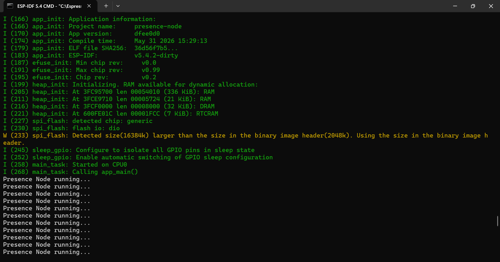

# FOUNDATION MILESTONE 001

## First Operational Node

Date: 31/05/2026

---

# Event

The first firmware of the Ambient Physical AI ecosystem was successfully built, flashed and executed.

Node:

```text
presence-node
```

Platform:

```text
CoreS3 Lite
ESP32-S3
ESP-IDF 5.4.2
```

---

# Validation Achieved

Successfully validated:

* repository structure;
* ESP-IDF environment;
* build system;
* flashing workflow;
* runtime execution;
* FreeRTOS startup.

---

# Runtime Output

```text
Presence Node running...
```

---

# Architectural Significance

This milestone marks the transition from:

```text
Architecture Phase
```

to:

```text
Implementation Phase
```

The project now possesses:

* validated development environment;
* operational firmware baseline;
* executable node architecture.

---

# Active Conceptual Flow

```text
Presence
→ Identity
→ Cognition
→ Ambient Transformation
→ Experience
```

---

# Guiding Principle

Demo First. Complexity Later.

---

# Status

Foundation Phase

Milestone Completed: ✅


## Evidence

First successful execution of the Presence Node.

