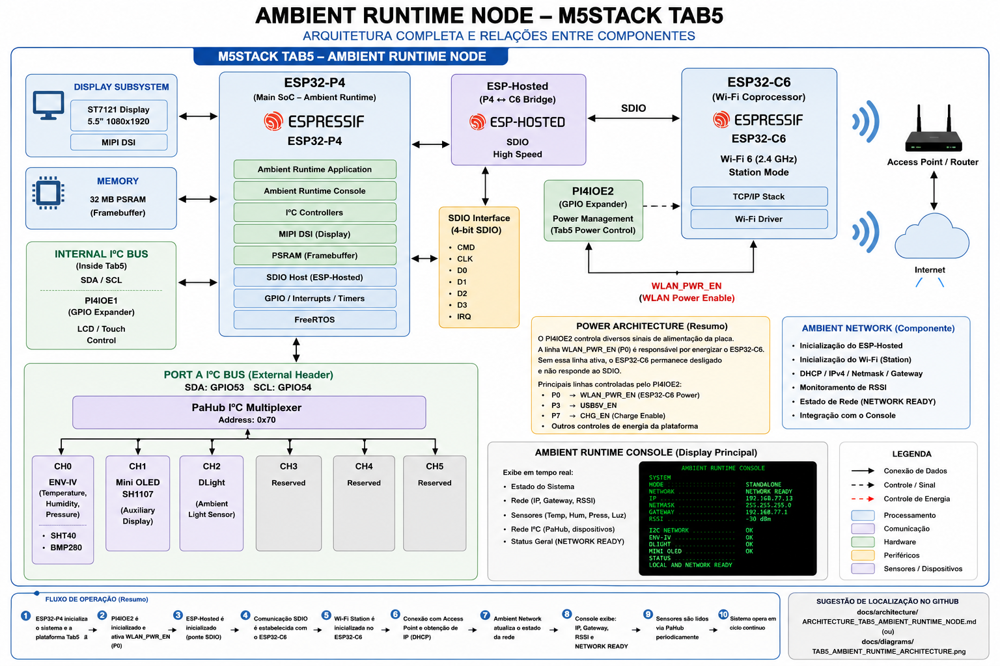

# Ambient Runtime Node

## Ambient Physical AI

### Distributed Cognitive Ecosystem Powered by StackFlow

> **Official Engineering README — Final Stable Baseline**

---

# Overview

The **Ambient Runtime Node** is the physical environment execution node of the **Ambient Physical AI** architecture.

This implementation runs on the **M5Stack Tab5**, based on the **ESP32-P4**, and is responsible for:

- acquiring environmental data;
- monitoring the local I²C device network;
- presenting the official Ambient Runtime Console;
- controlling auxiliary displays;
- representing the operational state of the physical environment;
- providing Wi-Fi connectivity through the onboard ESP32-C6 coprocessor;
- exposing the network state required by future distributed services;
- serving as the physical execution endpoint for future integration with the Cognitive Runtime.

The current implementation replaces the original PoE-P4 host while preserving the architectural responsibility of the Ambient Runtime.

The node is now considered a **stable network-enabled Ambient Runtime baseline**.

---

# Current Milestone

The current milestone completes the Ambient Runtime Node baseline on the Tab5.

Validated capabilities include:

- ESP32-P4 boot;
- 16 MB flash;
- 32 MB PSRAM;
- ST7121 display;
- MIPI DSI;
- RGB565 framebuffer rendering;
- LCD backlight control;
- internal I²C bus;
- PORT A I²C bus;
- PI4IOE1 initialization;
- PI4IOE2 initialization;
- ESP32-C6 power enable through `WLAN_PWR_EN`;
- ESP-Hosted integration;
- ESP Wi-Fi Remote integration;
- SDIO communication between ESP32-P4 and ESP32-C6;
- Wi-Fi Station mode;
- Wi-Fi association;
- DHCP;
- IPv4 address;
- network mask;
- default gateway;
- RSSI monitoring;
- PaHub channel selection;
- ENV-IV environmental sensing;
- DLight ambient light sensing;
- Mini OLED SH1107;
- periodic sensor acquisition;
- text-oriented Ambient Runtime Console;
- runtime health visualization;
- dynamic network state visualization;
- final runtime state `NETWORK READY`.

This milestone closes the local and network foundations of the Ambient Runtime Node.

Future work must focus on higher-level distributed services, not on redesigning the validated platform.

---

# Architectural Role

The Ambient Runtime Node is not the Cognitive Runtime.

Its responsibility is to interact with and represent the physical environment.

```text
Presence Layer
        │
        ▼
Identity Layer
        │
        ▼
Cognitive Runtime
        │
        ▼
Ambient Runtime
        │
        ▼
Physical Environment
```

The Cognitive Runtime is responsible for understanding context, reasoning and producing semantic decisions.

The Ambient Runtime is responsible for converting future semantic decisions into physical or visual environmental changes.

The current milestone provides the complete local and network foundation required for that future integration.

---

# System Architecture

```text
                         M5Stack Tab5
┌───────────────────────────────────────────────────────────────┐
│                                                               │
│  ESP32-P4                                                     │
│  ┌─────────────────────────────────────────────────────────┐  │
│  │ Ambient Runtime Application                             │  │
│  │                                                         │  │
│  │  ├── tab5_platform                                      │  │
│  │  ├── ambient_console                                    │  │
│  │  ├── ambient_network                                    │  │
│  │  ├── pahub                                              │  │
│  │  ├── env_iv                                             │  │
│  │  ├── dlight                                             │  │
│  │  └── oled_sh1107                                        │  │
│  └─────────────────────────────────────────────────────────┘  │
│                │                         │                    │
│                │                         │                    │
│          Internal I²C                ESP-Hosted               │
│                │                         │                    │
│       ┌────────┴────────┐                │ SDIO 4-bit         │
│       │                 │                │ 40 MHz             │
│   PI4IOE1           PI4IOE2              │                    │
│   0x43              0x44                 ▼                    │
│       │                 │           ESP32-C6                  │
│       │                 └─ P0      Wi-Fi coprocessor          │
│       │                    │                                  │
│       │              WLAN_PWR_EN                              │
│       │                    │                                  │
│       │              C6 power enabled                         │
│       │                                                       │
│  LCD / Touch                                                  │
│  control                                                      │
│                                                               │
│  PORT A I²C                                                   │
│  SDA GPIO53 / SCL GPIO54                                      │
│       │                                                       │
│       ▼                                                       │
│     PaHub 0x70                                                 │
│       ├── CH0 ENV-IV                                          │
│       ├── CH1 Mini OLED                                       │
│       └── CH2 DLight                                          │
└───────────────────────────────────────────────────────────────┘
                                      │
                                      ▼
                               Wi-Fi Access Point
                                      │
                                      ▼
                               Local IP Network
```

---

# Architecture Diagram



Complete architecture documentation:

```text
docs/architecture/TAB5_AMBIENT_RUNTIME_NODE_ARCHITECTURE.md
```

---

# Hardware Architecture

The Tab5 combines:

- ESP32-P4 as the primary application processor;
- ESP32-C6 as the wireless coprocessor;
- 32 MB external PSRAM;
- MIPI DSI display;
- internal I²C peripherals;
- two PI4IOE GPIO expanders;
- external PORT A I²C;
- integrated power-management controls.

The board must be treated as a multi-processor embedded platform.

The ESP32-P4 does not contain integrated Wi-Fi.

Wi-Fi is provided by the ESP32-C6 through the ESP-Hosted architecture.

---

# Hardware Inventory

| Device | Function | Interface | Status |
|---|---|---|---|
| M5Stack Tab5 | Main Ambient Runtime platform | ESP32-P4 | Validated |
| ST7121 display | Primary Runtime Console | MIPI DSI | Validated |
| 32 MB PSRAM | Runtime framebuffer and working memory | MSPI | Validated |
| PI4IOE1 | LCD, touch and board-control GPIO expander | Internal I²C, address `0x43` | Validated |
| PI4IOE2 | Wi-Fi power and board-control GPIO expander | Internal I²C, address `0x44` | Validated |
| ESP32-C6 | Wi-Fi coprocessor | ESP-Hosted / SDIO | Validated |
| PaHub | I²C multiplexer | PORT A I²C | Validated |
| ENV-IV | Temperature, humidity and pressure | PaHub CH0 | Validated |
| Mini OLED SH1107 | Auxiliary distributed display | PaHub CH1 | Validated |
| DLight | Ambient light measurement | PaHub CH2 | Validated |

---

# Internal I²C Architecture

The Tab5 internal I²C bus uses:

```text
SDA = GPIO31
SCL = GPIO32
```

The internal bus is responsible for board-level devices.

```text
ESP32-P4
    │
    ▼
Internal I²C
    │
    ├── PI4IOE1 — 0x43
    │   ├── LCD control
    │   ├── touch reset
    │   └── related platform control
    │
    └── PI4IOE2 — 0x44
        ├── WLAN_PWR_EN
        ├── USB 5V enable
        ├── charge control
        └── additional board control
```

The Ambient Runtime initializes both expanders.

---

# PORT A I²C Architecture

The external PORT A I²C bus uses:

```text
SDA = GPIO53
SCL = GPIO54
```

Current topology:

```text
ESP32-P4
    │
    ▼
PORT A I²C
SDA = GPIO53
SCL = GPIO54
    │
    ▼
PaHub
Address = 0x70
    │
    ├── CH0
    │   └── ENV-IV
    │       ├── SHT40
    │       └── BMP280
    │
    ├── CH1
    │   └── Mini OLED SH1107
    │
    └── CH2
        └── DLight
```

---

# PaHub Channel Allocation

| Channel | Device | Responsibility |
|---|---|---|
| CH0 | ENV-IV | Temperature, humidity and pressure |
| CH1 | Mini OLED | Auxiliary local status display |
| CH2 | DLight | Ambient light measurement |
| CH3 | Reserved | Future I²C device |
| CH4 | Reserved | Future I²C device |
| CH5 | Reserved | Future I²C device |

Channel allocation is centralized in `main/main.cpp`.

```cpp
static constexpr uint8_t PAHUB_CHANNEL_ENV_IV = 0;
static constexpr uint8_t PAHUB_CHANNEL_OLED   = 1;
static constexpr uint8_t PAHUB_CHANNEL_DLIGHT = 2;
```

---

# ESP32-P4 Responsibilities

The ESP32-P4 executes the complete Ambient Runtime application.

Current responsibilities include:

- platform initialization;
- internal I²C management;
- PI4IOE1 initialization;
- PI4IOE2 initialization;
- ESP32-C6 power control;
- MIPI DSI display initialization;
- ST7121 panel initialization;
- framebuffer management;
- PORT A I²C management;
- PaHub channel selection;
- ENV-IV acquisition;
- DLight acquisition;
- Mini OLED control;
- Ambient Runtime Console;
- ESP-Hosted host execution;
- Wi-Fi Station control;
- DHCP state management;
- RSSI monitoring;
- runtime state orchestration.

---

# ESP32-C6 Responsibilities

The ESP32-C6 is the Tab5 wireless coprocessor.

Responsibilities include:

- Wi-Fi PHY;
- Wi-Fi MAC;
- remote Wi-Fi execution;
- ESP-Hosted slave operation;
- SDIO communication with the ESP32-P4;
- future Bluetooth support if enabled.

The Ambient Runtime does not run the application directly on the ESP32-C6.

The ESP32-P4 invokes the normal ESP-IDF Wi-Fi API, and the calls are routed through ESP Wi-Fi Remote and ESP-Hosted to the C6.

---

# ESP-Hosted Architecture

```text
Ambient Runtime Application
        │
        ▼
ESP-IDF Wi-Fi API
        │
        ▼
ESP Wi-Fi Remote
        │
        ▼
ESP-Hosted
        │
        ▼
SDIO 4-bit / 40 MHz
        │
        ▼
ESP32-C6
        │
        ▼
Wi-Fi Access Point
```

The application remains independent from the low-level C6 firmware protocol.

---

# SDIO Configuration

Final validated mapping:

| Signal | ESP32-P4 GPIO |
|---|---:|
| D3 | GPIO8 |
| D2 | GPIO9 |
| D1 | GPIO10 |
| D0 | GPIO11 |
| CLK | GPIO12 |
| CMD | GPIO13 |
| ESP32-C6 RESET | GPIO15 |

Configuration:

```text
Slave target ........ ESP32-C6
Backend ............. ESP-Hosted
Transport ........... SDIO
Bus width ........... 4-bit
Clock ................ 40 MHz
Reset polarity ....... Active Low
```

---

# Major Engineering Discovery

The most important engineering discovery during this node development was that the ESP32-C6 is not automatically operational merely because ESP-Hosted and the SDIO pins are configured.

The C6 must first be explicitly powered through the Tab5 internal GPIO expander:

```text
PI4IOE2
I²C address 0x44
```

The critical signal is:

```text
P0 = WLAN_PWR_EN
```

Without this signal, the ESP32-P4 can initialize its SDIO host and pulse the reset line on GPIO15, but the ESP32-C6 does not respond correctly.

---

# Original Failure

Before PI4IOE2 support was added, the log reached:

```text
transport: Attempt connection with slave
transport: Reset slave using GPIO[15]
SDIO master: Data-Lines: 4-bit
sdmmc_init_ocr: send_op_cond returned 0x107
sdmmc_card_init failed
H_SDIO_DRV: sdio card init failed
```

The failure occurred before:

- Wi-Fi association;
- DHCP;
- IPv4 assignment;
- gateway acquisition;
- RSSI reporting.

Therefore, the problem was not the SSID, password, Station configuration or DHCP.

The failure was at the board power and SDIO bring-up layer.

---

# Root Cause

The original Ambient Runtime platform initialized only:

```text
PI4IOE1 = 0x43
```

The official M5Stack BSP revealed the second expander:

```text
PI4IOE2 = 0x44
```

and the function:

```cpp
bsp_set_wifi_power_enable(true);
```

This function activates:

```text
PI4IOE2 P0 = WLAN_PWR_EN
```

The missing dependency chain was:

```text
Internal I²C
    │
    ▼
PI4IOE2
    │
    ▼
WLAN_PWR_EN
    │
    ▼
ESP32-C6 powered
    │
    ▼
GPIO15 reset
    │
    ▼
SDIO enumeration
    │
    ▼
ESP-Hosted initialization
```

---

# PI4IOE2 Initialization

The Ambient Runtime reproduces the relevant official initialization sequence.

```text
CHIP_RESET  = 0xFF
IO_DIR      = 0b10111001
OUT_H_IM    = 0b00000110
PULL_SEL    = 0b10111001
PULL_EN     = 0b11111001
IN_DEF_STA  = 0b01000000
INT_MASK    = 0b10111111
OUT_SET     = 0b00001001
```

The output state:

```text
0x09
```

activates at least:

```text
P0 = WLAN_PWR_EN
P3 = USB5V_EN
```

Expected logs:

```text
init PI4IOE2 at I2C address 0x44
PI4IOE2 output state: 0x09
ESP32-C6 Wi-Fi power enabled
```

---

# Successful ESP32-C6 Bring-Up

After enabling `WLAN_PWR_EN`, the SDIO link became operational.

Validated logs include:

```text
SDIO master: Data-Lines: 4-bit Freq(KHz)[40000 KHz]
GPIOs: CLK[12] CMD[13] D0[11] D1[10] D2[9] D3[8] Slave_Reset[15]
```

The ESP32-C6 responded:

```text
Received INIT event from ESP32 peripheral
capabilities: 0xd
Features supported are:
    WLAN
    HCI over SDIO
    BLE only
ESP board type is : 13
Base transport is set-up
Slave chip Id[12]
```

This validates:

- ESP32-C6 power;
- reset;
- SDIO physical communication;
- ESP-Hosted transport;
- remote Wi-Fi capability negotiation.

No ESP32-C6 firmware reflash was required.

---

# Ambient Runtime Console

The Tab5 display is the official:

```text
Ambient Runtime Console
```

The console is intentionally implemented as a clean engineering interface.

It is not:

- an LVGL demonstration;
- an animated tablet interface;
- a general-purpose application;
- a decorative dashboard.

The console prioritizes:

- readability;
- system status;
- engineering clarity;
- demonstration reliability;
- real sensor data;
- real network data.

---

# Current Console Layout

```text
AMBIENT PHYSICAL AI
AMBIENT RUNTIME CONSOLE

SYSTEM
WI-FI ............ CONNECTED
IP ............... 192.168.77.13
MASK ............. 255.255.255.0

ENVIRONMENT
TEMPERATURE ....... xx.x C
HUMIDITY .......... xx.x %
PRESSURE .......... xxxx.x HPA
LIGHT ............. xxxx.x LX

I2C NETWORK
PAHUB ............. OK
ENV-IV ............ OK
DLIGHT ............ OK
MINI OLED ......... OK

STATUS
NETWORK READY
GW 192.168.77.1  RSSI -30 dBm
```

---

# Runtime Readiness States

The console exposes three primary health states.

## DEGRADED

```text
One or more mandatory local hardware devices are unavailable.
```

## LOCAL READY

```text
Local hardware is operational, but the network is not yet ready.
```

## NETWORK READY

```text
Local hardware is operational and DHCP has assigned network configuration.
```

State logic:

```cpp
const bool hardware_ready =
    data->pahub_ok &&
    data->env_iv_ok &&
    data->dlight_ok &&
    data->mini_oled_ok;

const bool runtime_ready =
    hardware_ready &&
    data->network_ready;
```

---

# Runtime Data Flow

```text
ENV-IV
    │
    ├── Temperature
    ├── Humidity
    └── Pressure
            │
            ▼
DLight
    │
    └── Ambient light
            │
            ▼
Ambient Network
    │
    ├── Wi-Fi state
    ├── IPv4
    ├── Netmask
    ├── Gateway
    └── RSSI
            │
            ▼
Ambient Runtime State
    │
    ├── Hardware health
    ├── Sensor values
    ├── I²C state
    └── Network state
            │
            ▼
Ambient Runtime Console
```

---

# Runtime Initialization Sequence

```text
Boot
 │
 ▼
Initialize ESP32-P4 runtime
 │
 ▼
Initialize internal I²C
 │
 ▼
Initialize PI4IOE2
 │
 ▼
Enable WLAN_PWR_EN
 │
 ▼
Wait for ESP32-C6 power stabilization
 │
 ▼
Initialize PORT A I²C
 │
 ▼
Initialize PI4IOE1
 │
 ▼
Initialize LCD / touch control
 │
 ▼
Initialize MIPI DSI
 │
 ▼
Initialize ST7121 panel
 │
 ▼
Initialize Ambient Console
 │
 ▼
Initialize Ambient Network
 │
 ├── NVS
 │
 ├── esp_netif
 │
 ├── event loop
 │
 ├── Wi-Fi Station netif
 │
 ├── ESP-Hosted connection
 │
 ├── Wi-Fi Station
 │
 └── DHCP
 │
 ▼
Initialize Mini OLED
 │
 ▼
Enter runtime loop
```

---

# Runtime Loop

```text
Runtime loop
 │
 ├── Select ENV-IV channel
 ├── Read SHT40
 ├── Read BMP280
 ├── Select DLight channel
 ├── Read lux
 ├── Revalidate Mini OLED channel
 ├── Read network snapshot
 ├── Update RSSI
 ├── Build console state
 ├── Render console
 ├── Log complete system health
 └── Wait 3 seconds
```

Current update interval:

```cpp
static constexpr TickType_t RUNTIME_UPDATE_INTERVAL =
    pdMS_TO_TICKS(3000);
```

---

# Sensor Responsibilities

## ENV-IV

### SHT40

Provides:

- temperature;
- relative humidity.

Example:

```text
SHT40 Temp: 30.67 C  Hum: 66.39 %
```

### BMP280

Provides:

- atmospheric pressure;
- secondary temperature measurement.

Example:

```text
BMP280 Temp: 31.35 C  Press: 1012.65 hPa
```

The console uses the SHT40 value as its primary environmental temperature.

## DLight

The DLight unit provides ambient light measurement in lux.

Example:

```text
DLight Lux: 166.67 lx
```

## Mini OLED SH1107

The Mini OLED is an auxiliary diagnostic display.

Current baseline:

- initialization validated;
- communication through PaHub validated;
- test content validated.

It is not the primary Runtime Console.

---

# Ambient Network Component

The network subsystem is implemented as an independent ESP-IDF component.

```text
components/
└── ambient_network/
    ├── CMakeLists.txt
    ├── ambient_network.cpp
    └── include/
        └── ambient_network.h
```

Responsibilities:

- NVS initialization;
- `esp_netif` initialization;
- default event loop creation;
- Wi-Fi Station netif creation;
- Wi-Fi event registration;
- IP event registration;
- Wi-Fi initialization;
- Station mode configuration;
- connection request;
- minimal reconnection;
- DHCP state capture;
- IPv4 storage;
- netmask storage;
- gateway storage;
- RSSI update;
- public network status snapshot.

Public API:

```cpp
esp_err_t ambient_network_init(void);

ambient_network_status_t
ambient_network_get_status(void);
```

---

# Network Status Structure

```cpp
typedef struct {
    bool initialized;
    bool connected;
    bool network_ready;

    char ipv4[16];
    char netmask[16];
    char gateway[16];

    int8_t rssi_dbm;
} ambient_network_status_t;
```

The application retrieves a snapshot without depending on the internal Wi-Fi implementation.

---

# Wi-Fi State Machine

```text
ambient_network_init()
        │
        ├── initialize NVS
        ├── initialize esp_netif
        ├── create default event loop
        ├── create default Wi-Fi STA netif
        ├── register WIFI_EVENT handler
        ├── register IP_EVENT handler
        ├── esp_wifi_init()
        ├── esp_wifi_set_mode(WIFI_MODE_STA)
        ├── esp_wifi_set_config()
        └── esp_wifi_start()
                │
                ▼
WIFI_EVENT_STA_START
                │
                ▼
esp_wifi_connect()
                │
                ▼
WIFI_EVENT_STA_CONNECTED
                │
                ▼
DHCP
                │
                ▼
IP_EVENT_STA_GOT_IP
                │
                ├── store IPv4
                ├── store netmask
                ├── store gateway
                └── set NETWORK READY
```

Minimal reconnection is requested after disconnection.

---

# Final Network Validation

Validated network:

```text
SSID: OKFIBRA-Claudio_2GHz
IPv4: 192.168.77.13
Netmask: 255.255.255.0
Gateway: 192.168.77.1
RSSI: approximately -29 to -32 dBm
```

Representative logs:

```text
ambient-network: Wi-Fi Station started
ambient-network: Connecting to SSID: OKFIBRA-Claudio_2GHz
ambient-network: Wi-Fi associated with access point
```

```text
esp_netif_handlers:
sta ip: 192.168.77.13,
mask: 255.255.255.0,
gw: 192.168.77.1
```

```text
ambient-network: DHCP IPv4 assigned
ambient-network: IP:      192.168.77.13
ambient-network: Netmask: 255.255.255.0
ambient-network: Gateway: 192.168.77.1
ambient-network: STATUS:  NETWORK READY
```

---

# Final Runtime Log

```text
Ambient Runtime alive |
Platform=OK |
I2C=OK |
ENV-IV=OK |
DLight=OK |
OLED=OK |
Wi-Fi=CONNECTED |
IP=192.168.77.13 |
Mask=255.255.255.0 |
GW=192.168.77.1 |
RSSI=-30 dBm |
STATUS=NETWORK READY
```

---

# Project Structure

```text
ambient-runtime-node/
│
├── CMakeLists.txt
├── README.md
├── sdkconfig
├── sdkconfig.defaults
│
├── main/
│   ├── CMakeLists.txt
│   ├── idf_component.yml
│   └── main.cpp
│
└── components/
    ├── README.md
    ├── ambient_console/
    ├── ambient_network/
    ├── dlight/
    ├── env_iv/
    ├── esp_lcd_st7121/
    ├── oled_sh1107/
    ├── pahub/
    └── tab5_platform/
```

---

# Component Responsibilities

| Component | Responsibility |
|---|---|
| `tab5_platform` | Tab5 initialization, PI4IOE1, PI4IOE2, C6 power, display, backlight and I²C buses |
| `esp_lcd_st7121` | ST7121 panel driver |
| `ambient_console` | Framebuffer, font rendering and Runtime Console |
| `ambient_network` | ESP-Hosted, Wi-Fi Station, DHCP, addresses, RSSI and network status |
| `pahub` | I²C multiplexer channel selection |
| `env_iv` | SHT40 and BMP280 measurements |
| `dlight` | Ambient light measurement |
| `oled_sh1107` | Mini OLED initialization and rendering |

Detailed component documentation is available in:

```text
components/README.md
```

---

# Platform Initialization Responsibilities

The `tab5_platform` component isolates board-specific code.

Responsibilities:

- internal I²C initialization;
- PORT A I²C initialization;
- PI4IOE1 initialization;
- PI4IOE2 initialization;
- `WLAN_PWR_EN`;
- ESP32-C6 power enable;
- LCD and touch reset;
- MIPI DSI PHY LDO configuration;
- MIPI DSI bus creation;
- DBI panel I/O creation;
- ST7121 panel creation;
- framebuffer drawing;
- LCD backlight control.

---

# Framebuffer

Resolution:

```text
720 × 1280
```

Pixel format:

```text
RGB565
```

Memory requirement:

```text
720 × 1280 × 2 bytes
= 1,843,200 bytes
```

The framebuffer is allocated in PSRAM:

```cpp
heap_caps_malloc(
    frame_size,
    MALLOC_CAP_SPIRAM | MALLOC_CAP_8BIT
);
```

---

# Text Rendering

The console uses a lightweight 8×8 bitmap font.

The current implementation provides:

- pixel rendering;
- character rendering;
- text rendering;
- configurable integer scaling;
- horizontal separators;
- formatted sensor values;
- formatted network values;
- dynamic runtime state.

This avoids introducing LVGL into the validated baseline and reduces dependency complexity and competition risk.

---

# Dependencies

The network layer uses ESP-IDF Component Manager dependencies.

```yaml
dependencies:
  idf: ">=5.3"
  espressif/esp_hosted: "1.4.0"
  espressif/esp_wifi_remote: "0.8.5"
```

Resolved components include:

```text
espressif__esp_hosted
espressif__esp_wifi_remote
espressif__eppp_link
espressif__esp_serial_slave_link
```

These generated dependencies are stored in:

```text
managed_components/
```

They should not be committed.

---

# Build Requirements

Validated environment:

```text
ESP-IDF 5.4.2
Target: ESP32-P4
Flash: 16 MB
PSRAM: 32 MB
ESP-Hosted: 1.4.0
ESP Wi-Fi Remote: 0.8.5
```

---

# Build

```cmd
cd C:\Users\profc\projetos\ambient-physical-ai\firmware\nodes\ambient-runtime-node
idf.py set-target esp32p4
idf.py reconfigure
idf.py build
```

The Component Manager resolves ESP-Hosted and ESP Wi-Fi Remote automatically.

---

# Flash

```cmd
idf.py flash monitor
```

Exit the monitor with:

```text
Ctrl + ]
```

---

# Expected Boot Sequence

```text
Ambient Physical AI - Ambient Runtime Console

Tab5 platform init based on H020 baseline
init internal I2C bus SDA=31 SCL=32

init PI4IOE2 at I2C address 0x44
PI4IOE2 output state: 0x09
ESP32-C6 Wi-Fi power enabled

init PORT A I2C bus SDA=53 SCL=54
init PI4IOE1 at I2C address 0x43
reset LCD_RST/TP_RST via PI4IOE1

Acquire MIPI DSI PHY LDO
Create MIPI DSI bus
Create DBI panel IO
Configure ST7121 DPI panel
Create ST7121 panel

Tab5 platform init OK

Ambient Runtime Console init
Console framebuffer allocated: 1843200 bytes

Ambient Network Wi-Fi Station initialization
NVS initialized

Attempt connection with slave
Reset slave using GPIO[15]
SDIO master: Data-Lines: 4-bit Freq(KHz)[40000 KHz]
Received INIT event from ESP32 peripheral
Base transport is set-up

Wi-Fi Station initialization complete
Wi-Fi Station started
Connecting to SSID: ...

Mini OLED initialized

Wi-Fi associated with access point
DHCP IPv4 assigned
STATUS: NETWORK READY
```

---

# Expected Runtime Behavior

After boot:

1. the ESP32-C6 is powered through PI4IOE2;
2. ESP-Hosted establishes the SDIO transport;
3. Wi-Fi Station starts;
4. the Tab5 display becomes active;
5. the Ambient Runtime Console is rendered;
6. temperature, humidity and pressure are read;
7. ambient light is read;
8. PaHub devices are checked;
9. Wi-Fi association occurs;
10. DHCP assigns IPv4, netmask and gateway;
11. RSSI is updated;
12. the console reports `NETWORK READY`;
13. the console is refreshed every three seconds;
14. the serial log reports the complete runtime state.

---

# Definition of Local Ready

The console reports `LOCAL READY` when all local mandatory devices are operational, but the network is not yet ready.

```text
PaHub
+
ENV-IV
+
DLight
+
Mini OLED
```

---

# Definition of Network Ready

The console reports `NETWORK READY` when:

```text
Local hardware ready
+
Wi-Fi associated
+
DHCP IPv4 assigned
+
Gateway available
```

---

# Known Limitations

| Item | Status |
|---|---|
| Cognitive Runtime connection | Not implemented |
| MQTT | Out of scope for this milestone |
| Semantic Events | Out of scope for this milestone |
| Dynamic Mini OLED content | Partially implemented |
| Touch interface | Not used |
| Advanced graphics | Out of scope |
| Wi-Fi credential provisioning | Not implemented |
| OTA | Not implemented |
| NTP | Not implemented |

The current direct Wi-Fi credentials are suitable only for the controlled laboratory and demonstration environment.

---

# Engineering Decisions

## Tab5 replaces PoE-P4

Previous host:

```text
PoE-P4
```

Current host:

```text
Tab5
```

The architectural responsibility remains unchanged.

## Text-oriented console

Reasons:

- deterministic rendering;
- easier debugging;
- lower complexity;
- reduced dependency risk;
- better readability;
- reliable competition demonstration.

## Component-based organization

Benefits:

- modularity;
- testability;
- reuse;
- easier maintenance;
- clearer documentation;
- independent evolution of platform and network layers.

## Board power belongs to `tab5_platform`

PI4IOE2 and `WLAN_PWR_EN` are board-level responsibilities.

They are implemented in:

```text
tab5_platform
```

They are not implemented in:

```text
ambient_network
```

## Network services belong to `ambient_network`

Wi-Fi Station, DHCP, addresses, RSSI and network status are encapsulated in:

```text
ambient_network
```

## Official M5Stack implementation as specification

The official M5Stack UserDemo and BSP were used to identify:

- ESP-Hosted versions;
- C6 target;
- SDIO mapping;
- PI4IOE2;
- `WLAN_PWR_EN`;
- board power sequence.

The project did not redesign the official transport architecture.

## Local readiness separated from network readiness

The console differentiates:

```text
DEGRADED
LOCAL READY
NETWORK READY
```

---

# Challenges Overcome

## Display Bring-Up

The Tab5 display required dedicated investigation involving:

- MIPI DSI;
- DBI;
- DPI;
- ST7121/ST7123 driver analysis;
- PSRAM;
- framebuffer allocation;
- panel initialization sequences.

The final runtime uses a stable ST7121-based display baseline.

## PSRAM and Framebuffer

The full console framebuffer requires approximately 1.84 MB.

PSRAM was validated and used for framebuffer allocation.

## Internal and External I²C Separation

The final platform keeps:

```text
Internal I²C
```

separate from:

```text
PORT A I²C
```

This prevents board-control devices from being mixed with external Grove peripherals.

## PaHub Multiplexing

The system validates explicit channel selection before accessing each external device.

## Sensor Integration

ENV-IV and DLight were integrated as reusable components with typed data and periodic acquisition.

## ESP32-C6 Power Discovery

The missing `WLAN_PWR_EN` sequence was identified through BSP inspection and validated on real hardware.

## ESP-Hosted SDIO Bring-Up

The SDIO timeout was resolved without redesigning ESP-Hosted or reflashing the C6 firmware.

## Network State Integration

Wi-Fi association, DHCP, addresses, gateway and RSSI were integrated without placing Wi-Fi internals in `main.cpp`.

---

# Current Validation Matrix

| Capability | Status |
|---|---|
| ESP32-P4 boot | PASS |
| Flash 16 MB | PASS |
| PSRAM 32 MB | PASS |
| MIPI DSI | PASS |
| ST7121 display | PASS |
| RGB565 framebuffer | PASS |
| LCD backlight | PASS |
| Internal I²C | PASS |
| PORT A I²C | PASS |
| PI4IOE1 | PASS |
| PI4IOE2 | PASS |
| ESP32-C6 power enable | PASS |
| ESP-Hosted | PASS |
| ESP Wi-Fi Remote | PASS |
| SDIO 4-bit / 40 MHz | PASS |
| ESP32-C6 INIT event | PASS |
| Wi-Fi Station | PASS |
| Wi-Fi association | PASS |
| DHCP | PASS |
| IPv4 address | PASS |
| Netmask | PASS |
| Gateway | PASS |
| RSSI | PASS |
| PaHub | PASS |
| ENV-IV SHT40 | PASS |
| ENV-IV BMP280 | PASS |
| DLight | PASS |
| Mini OLED SH1107 | PASS |
| Periodic runtime loop | PASS |
| Real sensor data on console | PASS |
| Real network data on console | PASS |
| Local hardware health | PASS |
| `NETWORK READY` | PASS |
| Cognitive Runtime connection | NOT IMPLEMENTED |
| MQTT | OUT OF SCOPE |
| Semantic Events | OUT OF SCOPE |

---

# Recommended Development Workflow

```text
Implement
    │
    ▼
Build
    │
    ▼
Flash
    │
    ▼
Validate logs
    │
    ▼
Validate display
    │
    ▼
Validate hardware
    │
    ▼
Document
    │
    ▼
Commit
```

---

# Repository Hygiene

Before committing:

```cmd
git status
```

The repository should not track:

```text
build/
managed_components/
sdkconfig.old
.vscode/
__pycache__/
README*.old
```

The validated `sdkconfig` currently contains important ESP-Hosted and SDIO settings.

Before removing it from version control, the essential values must be migrated to:

```text
sdkconfig.defaults
```

Expected versioned files include:

```text
README.md
sdkconfig.defaults
main/
components/
docs/architecture/
```

---

# Suggested Commit Scope

```text
feat(ambient-runtime): complete Tab5 network-enabled runtime baseline
```

Suggested description:

```text
- finalize Tab5 Ambient Runtime Console
- validate periodic ENV-IV sensor acquisition
- validate periodic DLight lux acquisition
- validate PaHub channel topology
- retain Mini OLED as auxiliary display
- initialize PI4IOE2
- enable ESP32-C6 through WLAN_PWR_EN
- integrate ESP-Hosted and ESP Wi-Fi Remote
- validate SDIO transport
- add ambient_network component
- implement Wi-Fi Station
- implement DHCP, IPv4, netmask and gateway reporting
- add RSSI monitoring
- report NETWORK READY state
- document final Ambient Runtime architecture
```

---

# Final Current State

```text
Tab5
    │
    ├── ESP32-P4 ............ OK
    ├── Display ............. OK
    ├── PSRAM ............... OK
    ├── Internal I²C ........ OK
    ├── PI4IOE1 ............. OK
    ├── PI4IOE2 ............. OK
    ├── ESP32-C6 Power ...... OK
    ├── ESP-Hosted .......... OK
    ├── SDIO ................ OK
    ├── Wi-Fi Station ....... CONNECTED
    ├── DHCP ................ OK
    ├── IPv4 ................ ASSIGNED
    ├── Gateway ............. ASSIGNED
    ├── RSSI ................ VISIBLE
    ├── PORT A I²C .......... OK
    ├── PaHub ............... OK
    ├── ENV-IV .............. OK
    ├── DLight .............. OK
    ├── Mini OLED ........... OK
    ├── Runtime Console ..... OK
    ├── Periodic Updates .... OK
    └── STATUS .............. NETWORK READY
```

The validated baseline is suitable for:

- competition demonstration;
- environmental sensing;
- engineering inspection;
- distributed node integration;
- future Cognitive Runtime communication;
- future semantic event execution.

---

# Roadmap Transition

The Ambient Runtime Node baseline is complete.

The next project priority becomes:

```text
AX630C Cognitive Runtime
```

The Ambient Runtime should now remain frozen except for:

- confirmed regressions;
- essential documentation corrections;
- repository hygiene;
- final evidence collection;
- explicitly authorized integration missions.

---

# Ambient Physical AI

```text
Presence
    │
    ▼
Identity
    │
    ▼
Cognitive Runtime
    │
    ▼
Ambient Runtime
    │
    ▼
Physical Environment
```

Current Ambient Runtime status:

```text
LOCAL HARDWARE READY
+
NETWORK READY
=
AMBIENT RUNTIME NODE V1 COMPLETE
```

---

# References

- M5Stack Tab5 official hardware documentation
- M5Stack M5Tab5 UserDemo
- Espressif ESP-Hosted
- Espressif ESP Wi-Fi Remote
- ESP-IDF 5.4.2
- Ambient Physical AI architecture documentation

---

# Final Statement

The Ambient Runtime Node evolved from a local hardware console into a complete network-capable physical runtime node.

The final implementation provides:

```text
Environmental sensing
+
hardware supervision
+
runtime visualization
+
ESP32-C6 Wi-Fi connectivity
+
DHCP network identity
+
NETWORK READY state
```

The decisive discovery was the board-level power dependency:

```text
PI4IOE2
    │
    ▼
WLAN_PWR_EN
    │
    ▼
ESP32-C6
```

Once this dependency was reproduced from the official M5Stack BSP, the complete ESP-Hosted, SDIO, Wi-Fi Station, DHCP, IPv4, gateway and RSSI chain became operational.

This README represents the final validated engineering baseline of the Ambient Runtime Node.
